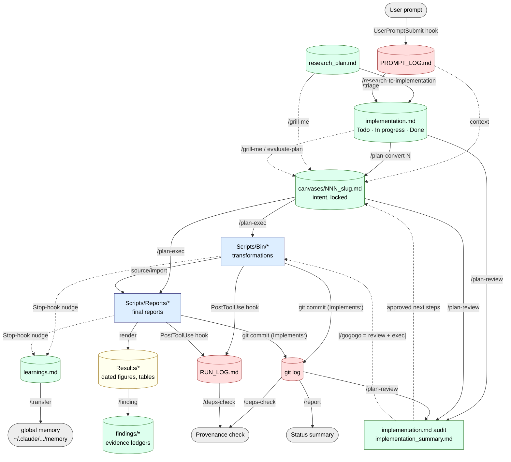

# `~/.claude` — Personal Claude Code configuration

This repo is my Claude Code home directory: custom **skills**, slash **commands**,
**hooks**, and helper **scripts** that turn Claude Code into a reproducible
bioinformatics research assistant.

```
~/.claude/
├── CLAUDE.md            # global instructions for every session
├── settings.json        # global permissions, hooks, statusline, theme
├── skills/              # custom + bundled skills (research-setup, finding, transfer, …)
├── commands/            # canvas-pipeline slash commands (triage, plan-convert, …)
├── scripts/             # hook scripts + project bootstrap/retrofit tooling
└── statusline.sh        # custom status line
```

The centrepiece is the **canvas pipeline** — a prompt-driven, fully-traceable
workflow for analytical projects. The rest of this README is a tutorial for it.

---

# The Canvas Pipeline

## Why

Every figure in a project should be walkable back to the **exact user prompt**
that asked for it. The pipeline enforces that chain: prompts are logged, curated
into a backlog, frozen into a per-task **canvas** (structured intent) *before* any
code is written, implemented as dual-mode scripts + reports, and rendered to dated
figures whose captions cite their canvas. Knowledge that would otherwise evaporate
(gotchas, scientific findings) is captured alongside.

## Mental model

```
prompt  →  backlog  →  canvas (intent, locked)  →  code + report  →  dated figure
  │           │              │                          │                 │
PROMPT_LOG  implementation  canvases/NNN          Bin/ + Reports/      Results/*.pdf
                                                                    caption: (canvas: NNN)
```

Two file *families* matter:

| Family | Files | Edited |
|---|---|---|
| **Logs** (auto, append-only) | `Prompts/Logs/PROMPT_LOG.md`, `Prompts/Logs/RUN_LOG.md` | by hooks, never by hand |
| **Curated docs** | `Prompts/research_plan.md`, `implementation.md`, `canvases/NNN_*.md`, `learnings.md`, `findings/` | via the commands below |

## Command-flow graph



---

## Tutorial: a project from scratch

### 0. Scaffold the project

```
/research-setup MyProject
```

Creates the folder structure, R/Python environment, git repo, the `Prompts/`
docs, and installs the **project-scoped hooks** (`.claude/settings.json`) that
auto-log prompts and script runs and nudge you to capture learnings. To just drop
the doc templates into the current dir without full setup: `/research-setup print`.

> Retrofitting an *existing* project instead? Use the `/pipeline-adopt` command,
> or run `python3 ~/.claude/scripts/install-project-hooks.py` to add the hooks +
> `learnings.md`/`findings/` to every project under `~/Projects`.

### 1. Write the scientific plan

Fill in `Prompts/research_plan.md` — questions, data sources, **positive/negative
controls**, expected outputs. This is the only hand-authored scientific document;
everything downstream references it.

### 2. Seed the backlog

```
/research-to-implementation      # turn research_plan.md into implementation.md Todo items
```

As you work and type requests, the `UserPromptSubmit` hook records every prompt to
`PROMPT_LOG.md`. Periodically fold new requests into the backlog:

```
/triage                          # PROMPT_LOG.md → implementation.md (Todo)
```

### 3. (Optional) Interrogate before committing

```
/grill-me                        # one question at a time, resolves TBDs in the target
/evaluate-plan                   # same idea, scoped to a plan/canvas file
```

These surface unstated parameters, controls, and edge cases *before* code exists.

### 4. Freeze intent into a canvas

```
/plan-convert 3                  # backlog item 3 → Prompts/canvases/NNN_slug.md
```

A **canvas** is the structured spec for one task: the question, inputs/outputs,
method, parameters, controls. **Code is mistrusted without a canvas.** Tighten it
further with `/grill-me canvases/NNN_*.md` if needed.

### 5. Implement

```
/plan-exec                       # implement the in-progress canvas(es)
```

Writes **dual-mode** `Scripts/Bin/*` transformations (a function + a CLI shim, so
the same code is `source()`d by reports *and* callable from bash/Snakemake),
`Scripts/Reports/NN_*.Rmd` reports that render but never transform, runs them
(auto-logged to `RUN_LOG.md`), saves dated PDFs to `Results/<report>/`, and commits
with an `Implements: Prompts/canvases/NNN_*.md` trailer. Every figure caption ends
with `(canvas: NNN)`.

### 6. Capture knowledge

```
/finding "tumor samples lose X expression vs normal"   # → findings/{topic}.md (F-NNN + evidence)
```

When a session ends after real work with nothing recorded, the **learn-nudge Stop
hook** softly reminds you to add a one-liner to `Prompts/learnings.md`. Later,
promote the broadly-useful ones into global memory:

```
/transfer                        # sibling learnings.md → ~/.claude/.../memory
```

### 7. Review, report, verify

```
/plan-review                     # audit progress, refresh implementation_summary.md, pick next steps
/gogogo                          # review + execute all uncompleted items in one shot
/report                          # status summary from git log + CHANGELOG + implementation.md
/deps-check                      # recompute sha256s, validate canvas/figure backlinks, detect drift
/wup                             # current session status (tasks, agents, plan progress)
```

---

## Command reference

### Canvas pipeline (`commands/`)

| Command | Reads | Writes / effect |
|---|---|---|
| `/research-to-implementation` | `research_plan.md` | seeds `implementation.md` Todo |
| `/triage` | `PROMPT_LOG.md`, `implementation.md` | new Todo entries with `[log: <iso>]` markers |
| `/grill-me [file]` | target doc | resolves TBDs, one Q&A at a time |
| `/evaluate-plan [file]` | a plan/canvas | same, scoped to that artifact |
| `/plan-convert <N>` | Todo item N, `PROMPT_LOG.md`, prior canvases | `canvases/NNN_slug.md`; item → In progress |
| `/plan-exec [N\|canvas]` | the canvas, `Bin/` helpers | `Bin/` scripts, `Reports/` reports, `Results/` figures, git commit, item → Done |
| `/plan-review [file]` | `implementation.md`, code, git log | audit commit, `implementation_summary.md`, next-step picks |
| `/gogogo` | (composite) | `/plan-review` then `/plan-exec` on all uncompleted items |
| `/deps-check` | `dependencies.json`, headers, files | verifies hashes + backlinks, reports drift |
| `/pipeline-adopt` | existing project | backfills scaffolding, reverse-engineers canvases |
| `/report` | git log, `CHANGELOG.md`, `implementation.md` | status summary to chat |
| `/wup` | running tasks/agents/plan | session status to chat |

### Pipeline skills (`skills/`)

| Skill | Purpose |
|---|---|
| `/research-setup [name\|print]` | scaffold a new project (folders, env, git, hooks, docs) |
| `/finding [claim]` | record a scientific finding into `findings/{topic}.md` (`F-NNN` + evidence) |
| `/transfer [push\|pull]` | promote generalizable project learnings up to global memory (or surface memory down) |
| `/brainstorm`, `/brainstrom` | propose new analytical directions (collaborative / wild) |
| `/getinfo` | survey a project and explain what it's about |
| `/kanban` | cross-project task board over `~/Projects` |
| `/handoff` | compact the conversation into a handoff doc |

---

## Automation (hooks)

Installed per-project via `scripts/project-settings-template.json` (only active in
projects that contain a `Prompts/` directory):

| Event | Trigger | Effect |
|---|---|---|
| `UserPromptSubmit` | every prompt | append to `Prompts/Logs/PROMPT_LOG.md` |
| `PostToolUse` (Bash) | script invocation (`Rscript`/`python`/`snakemake`/`bash *.sh`/`./*.{R,py,sh,Rmd}`) | append to `Prompts/Logs/RUN_LOG.md` |
| `PostToolUse` (Edit/Write/Bash) | substantive work | drop a transient `.work-<sid>` marker |
| `Stop` | session end | **soft, one-time** nudge to record a learning if work happened and none was logged |

Scripts: `prompt-log.py`, `work-marker.py`, `learn-nudge.py`. Bootstrap/retrofit:
`install-project-hooks.py` (`--dry-run`, `--no-seed` available).

---

## Rules that hold across the pipeline

- **`Bin/` vs `Reports/`** — all data transformations live in `Scripts/Bin/` as
  dual-mode files (function + CLI shim); `Scripts/Reports/` only renders.
- **Canvas-first** — when output is wrong, fix the canvas, then the code, then
  re-run. Code without a canvas is mistrusted (cosmetic hot-fixes excepted).
- **Provenance trailer** — every implementing commit ends with
  `Implements: Prompts/canvases/NNN_slug.md`.
- **Figure backlink** — every figure caption ends with `(canvas: NNN)`; PDFs are
  dated `Results/<report>/<yymmdd>_<Type>_<Name>.pdf`.
- **Hash inputs** — every `data` node in `Prompts/dependencies.json` carries a
  `sha256`; reports verify on load.
- **Static side wins** — script headers, `INDEX.md`, `dependencies.json` are the
  source of truth; `RUN_LOG.md` is the dynamic trace. On disagreement, fix the
  static side.

### Provenance chain (figure → prompt)

A figure walks back through six layers, and is **not trusted** if any link is
missing: **figure** `(canvas: NNN)` → **canvas** (`source_prompt_log:` timestamp)
→ **implementation.md** (`→ canvases/NNN` backlink) → **PROMPT_LOG.md** (verbatim
prompt) → **git log** (`Implements:` trailer) → **RUN_LOG.md** (invocations).
