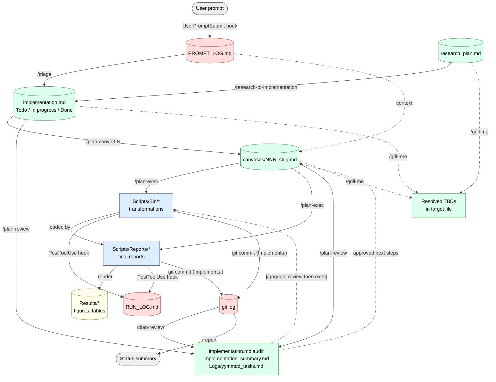

# Research Project Setup

## Print Mode

If the argument is `print`, write three templates to the current directory (create `Prompts/` if needed) and stop:

1. `./Prompts/research_plan.md` — research-plan template (below)
2. `./CLAUDE.md` — project conventions template (see "CLAUDE.md Template" section)
3. `./PIPELINE.md` — prompt-driven workflow + per-command I/O reference (see "PIPELINE.md Template" section)

The research_plan.md template content:

---BEGIN research_plan.md TEMPLATE---
# Research Plan

> For project conventions, folder structure, computing environment, and
> workflow rules, see `CLAUDE.md`. This document is the **scientific
> plan** only — what is being studied and why.

## Project Description

<!-- One paragraph: what this project investigates and why. -->

## Environment Variables

<!-- Project-specific values referenced throughout the codebase. -->

- **project_name**:
- **home_folder**:
- **data_folder**:
- **sample_sheet**:

## Background & Motivation

<!-- Prior work, gap in the literature, biological/clinical context.
     What makes this question worth asking now? -->

## Scientific Questions

<!-- The concrete questions the analyses must answer. One per bullet.
     Order from primary to exploratory. -->

1.
2.
3.

## Data Sources

<!-- For each dataset: accession or path, organism, modality, sample
     count, source publication or grant. Note ownership and any
     embargoes. -->

| Dataset | Modality | Accession / Path | Samples | Source |
|---------|----------|------------------|---------|--------|

## Planned Analyses

<!-- High-level analyses in order. Each becomes one or more reports
     under Scripts/Reports/ and one or more canvases under
     Prompts/canvases/. -->

1.
2.
3.

## Constraints

<!-- The guardrails: what defines a valid result, what must not happen,
     and what every analysis must respect. Treat these as test
     oracles — every report should be checkable against them. -->

### Positive controls

<!-- Things that MUST work / show signal to prove the pipeline is
     functioning. Known true-positives, spike-ins, marker genes whose
     behavior is established. If a positive control fails, halt and
     debug — don't trust downstream results. -->

-

### Negative controls

<!-- Things that should NOT show signal. Null samples, shuffled labels,
     randomized data, regions of the genome with no expected effect.
     If a negative control fires, you have a false-positive source. -->

-

### Workflow constraints

<!-- Non-negotiables on how the analysis must run. Tools/versions to
     use or avoid, ordering dependencies between steps, time/compute
     budgets, reproducibility requirements (seeds, deterministic
     pipelines), data-locality rules. -->

-

### Important variables

<!-- Biological and technical covariates that every analysis must
     track and report on. Batch, donor, sex, age, condition, library
     prep, sequencer, etc. Anything that could confound results if
     ignored. Include the column name in the sample sheet. -->

| Variable | Type | Sample-sheet column | Why it matters |
|----------|------|--------------------|----------------|

## Expected Outputs

<!-- Reports, figures, tables, supplementary materials that this
     project will produce. Tie each to a Scientific Question above. -->

-

## Open Questions / TBD

<!-- Unresolved scientific or methodological decisions. Items here
     should be raised with the user before relevant canvases are
     written. -->

-

---END research_plan.md TEMPLATE---

After writing the file, confirm the path to the user. Do not proceed with project setup.

---

## Setup Mode

Collect the required information from the user, then scaffold the project.

### Required Information

Ask the user to fill in (use `$ARGUMENTS` for project_name if provided):

- **project_name**: e.g., `AAkalin_Urine`
- **project_description**: Brief scientific description
- **home_folder**: Path to project home (code and scripts)
- **data_folder**: Path to data storage (large-volume filesystem)
- **sample_sheet**: Path to sample sheet (if applicable)

### Actions

1. Create the folder structure shown in the template above (including `Prompts/Logs/` and `Prompts/canvases/`)
2. Create `Data/` as a **symlink** to `<data_folder>/<project_name>/Data` (create target if needed)
3. Set up computing environment (R with renv, Python env)
4. Initialize git repository
5. Create `CHANGELOG.md` with project name header and "Project created" entry dated today
6. Write `CLAUDE.md` using the template below
6b. Write `PIPELINE.md` at the project root using the "PIPELINE.md Template" section below
7. Seed `Scripts/INDEX.md` with the header row only: `| Path | Lang | Purpose | Inputs | Outputs | Upstream | Downstream |` plus separator row — no entries yet
8. Seed `Prompts/implementation.md` with three empty sections: `## Todo`, `## In progress`, `## Done` — and a one-line preface explaining that `/triage` populates Todo from `PROMPT_LOG.md`
9. Add a placeholder `Prompts/canvases/.gitkeep` so the empty directory tracks in git
10. Install the project-scoped auto-logging hooks: copy `~/.claude/scripts/project-settings-template.json` to `<home_folder>/.claude/settings.json` (create the `.claude/` directory). This file activates `PROMPT_LOG.md` and `RUN_LOG.md` only when Claude Code runs in this project. If `.claude/settings.json` already exists, MERGE the `hooks` block in rather than overwriting the file.
11. Ask the user to describe the scientific analysis plan

---

## CLAUDE.md Template

When creating `CLAUDE.md` for a new project (both Print Mode and Setup Mode), use this content, substituting `<project_name>`, `<home_folder>`, and `<data_folder>`:

---BEGIN CLAUDE.md TEMPLATE---
# <project_name> — Project Conventions

> Workflow, command I/O, provenance chain, canvas-before-code rule: see `PIPELINE.md` at project root.

## Folders

    <home_folder>/
    ├── Scripts/
    │   ├── Bin/          # Transformations + functions (standalone bash callable)
    │   └── Reports/      # Final reports only — render, never transform
    ├── Results/<report>/yymmdd_Type_Name.pdf
    ├── Data/             # symlink → <data_folder>/<project_name>/Data
    ├── Documentation/    # processed data from publications
    ├── Prompts/
    │   ├── research_plan.md, implementation.md
    │   ├── canvases/NNN_slug.md
    │   └── Logs/{PROMPT,RUN}_LOG.md    # auto, append-only
    ├── PIPELINE.md, CHANGELOG.md

- Downloaded data → `Data/` with `README` (source + date)
- `CHANGELOG.md` = cross-session memory; update every meaningful unit, record failed approaches, note blockers

## Environment

- **R** — keep existing env if `renv.lock` / active `renv/` / documented version exists; else newest R on system. `renv` for reproducibility. cacheR: `remotes::install_github("BIMSBbioinfo/cacheR")`
- **Python** — base `/home/vfranke/bin/mamba/miniforge/bin/python`; per-project conda/mamba or venv
- **Git** — repo in `<home_folder>`; canvas-implementing commits carry `Implements:` trailer

## Bin/ vs Reports/ (core rule)

- All transformations (filter, normalize, join, reshape, summarize, convert) live in `Scripts/Bin/`
- Every Bin/ script is standalone bash-callable: `Rscript|python|bash Scripts/Bin/<name> <args>` — args in, no hidden state
- `Scripts/Reports/` only loads Bin/ outputs and renders; never transforms
- Notebook exploration ok; the moment it feeds a downstream artifact, move it to Bin/
- **All outputs go under `Results/<report>/`** — figures, tables, and any pipeline state (JSON / TSV trackers, lockfiles, run metadata) under `Results/<report>/pipeline_state/`. **Never write to `Data/`** — it's a symlink to external read-mostly storage.

## Data Provenance

- Newest upstream always — never hardcode dated paths. Resolve "latest" via a date-sorted glob.
- Re-run downstream when upstream changes; warn if cache stale vs upstream mtime
- **Hash input data** — every `data`-type node in `Prompts/dependencies.json` carries a `sha256` field. Reports verify the hash on load; mismatch = halt and investigate. Helpers: `digest::digest(file, algo="sha256", file=TRUE)` (R) / `hashlib.sha256(open(f,"rb").read()).hexdigest()` (Python) / `sha256sum <file>` (shell).

## Report Input Files

Every `.Rmd` lists inputs near top (YAML `inputs:` or `## Inputs` section), each as: **path, type** (raw / cacheR / upstream figure / external), **source** (producing report or publication), **used for**. Update with code.

## Figure Documentation

Every figure caption covers: **input** (source, filter/transform), **method** (functions, params, tests, thresholds), **what it shows**. Caption ends with `(canvas: NNN)`. Keep in sync with code.

**Knit output**: every figure saved as a PDF under `Results/<report>/` named `<yymmdd>_<Type>_<Name>.pdf` (e.g. `260518_Volcano_treated-vs-ctrl.pdf`). R Markdown chunk defaults: `dev = "pdf"`, `fig.path = "Results/<NN_report>/<yymmdd>_"`.

## Oracle Testing

Validate against established tools and the positive/negative controls in `research_plan.md` before trusting downstream. On disagreement, bisect upstream. No fudge factors — find the bug.

## Script Tracking

- **`Prompts/Logs/RUN_LOG.md`** — PostToolUse hook auto-appends every Rscript / python / snakemake / bash invocation. Append-only; read tail at session start.
- **`Scripts/INDEX.md`** — one row per script: `| Path | Lang | Purpose | Inputs | Outputs | Upstream | Downstream |`. Stale rows worse than none.
- **Header** (every `Scripts/Bin/` file and `.Rmd` preamble):

      # Canvas:     Prompts/canvases/NNN_slug.md
      # Purpose:    <one line, mirrors canvas Question>
      # Inputs:     <path> (<type>), ...
      # Outputs:    <path> (<type>), ...
      # Upstream:   <script/report producing inputs>
      # Downstream: <script/report consuming outputs>

## Analysis Dependencies

`Prompts/dependencies.json` — DAG of data → reports → figures (`nodes`, `edges` arrays). Each `data`-type node carries a `sha256` of its content (see Data Provenance). Update on add/modify. Static side (headers, INDEX.md, dependencies.json) is source of truth; `RUN_LOG.md` is the dynamic trace. When they disagree, fix the static side.
---END CLAUDE.md TEMPLATE---

---

## PIPELINE.md Template

When scaffolding a new project (both Print Mode and Setup Mode), also write `PIPELINE.md` at the project root using this content verbatim:

---BEGIN PIPELINE.md TEMPLATE---
# Pipeline

This project's prompt-driven workflow chains a small set of slash commands and four key file families. Every figure can be walked back to the user prompt that requested it.

## Files at a glance

| File | Role | Edit policy |
|------|------|-------------|
| `Prompts/Logs/PROMPT_LOG.md`        | Verbatim user prompts                                  | auto-appended, never edit |
| `Prompts/Logs/RUN_LOG.md`           | Verbatim script invocations                            | auto-appended, never edit |
| `Prompts/research_plan.md`          | High-level scientific plan                             | hand-curated |
| `Prompts/implementation.md`         | Curated backlog (`## Todo` / `In progress` / `Done`)   | curated via `/triage` |
| `Prompts/canvases/NNN_slug.md`      | Structured intent per task — locked before code        | written via `/plan-convert` |
| `Scripts/Bin/<name>.{R,py,sh}`      | Data transformations (standalone bash callable)        | written via `/plan-exec` |
| `Scripts/Reports/NN_<name>.Rmd`     | Final reports — consume Bin/ outputs, do not transform | written via `/plan-exec` |
| `Results/<report>/yymmdd_*.pdf`     | Figures with `(canvas: NNN)` caption backlinks         | rendered by reports |
| `Prompts/implementation_summary.md` | Project overview, one section per report               | maintained by `/plan-review` |
| `Prompts/dependencies.json`         | Data-flow DAG (`nodes`, `edges`); `data` nodes carry `sha256` | hand-maintained per `/plan-exec` |
| `Scripts/INDEX.md`                  | One-row-per-script manifest                            | hand-maintained on add/rename |
| `CHANGELOG.md`                      | Cross-session shared memory                            | updated end of every work unit |

## Pipeline graph

## Per-command I/O

### Automated hooks (no command required)

| Trigger              | Reads                                                                          | Writes                                |
|----------------------|--------------------------------------------------------------------------------|----------------------------------------|
| `UserPromptSubmit`   | user's prompt text                                                             | `Prompts/Logs/PROMPT_LOG.md` (append) |
| `PostToolUse` (Bash) | script invocations matching `Rscript`, `python`, `snakemake`, `bash *.sh`, `./*.{R,py,sh,Rmd}` | `Prompts/Logs/RUN_LOG.md` (append)    |

### Slash commands

| Command | Reads | Writes / Side effects |
|---------|-------|------------------------|
| `/research-setup print`        | (none)                                                                                                          | `Prompts/research_plan.md`, `CLAUDE.md`, `PIPELINE.md` (templates) |
| `/research-setup <name>`       | user-supplied parameters                                                                                        | full project scaffold (folders, env, git, settings, `INDEX.md`, `implementation.md` skeleton, `CHANGELOG.md`, `CLAUDE.md`, `PIPELINE.md`) |
| `/research-to-implementation`  | `Prompts/research_plan.md`                                                                                      | `Prompts/implementation.md` (initial `## Todo` seeded from planned analyses) |
| `/triage`                      | `Prompts/Logs/PROMPT_LOG.md`, `Prompts/implementation.md`                                                       | `Prompts/implementation.md` (new Todo entries with `[log: <iso>]` markers) |
| `/grill-me [file]`             | target file (`implementation.md`, a canvas, or `research_plan.md`)                                              | updated target with resolved TBDs (one Q&A at a time) |
| `/plan-convert <N>`            | `Prompts/implementation.md` Todo item N, `PROMPT_LOG.md`, `Data/`, `Documentation/`, prior canvases, `Scripts/Bin/` | new `Prompts/canvases/NNN_slug.md`; `implementation.md` Todo→In progress + `→ canvases/NNN_*.md` backlink |
| `/plan-exec [N or canvas]`     | canvas at `Prompts/canvases/NNN_*.md`, `Prompts/implementation.md`, `Scripts/Bin/` helpers                       | `Scripts/Bin/<name>.{R,py,sh}` (transformations), `Scripts/Reports/NN_<name>.Rmd` (reports), `Results/<report>/yymmdd_*.pdf` (figures with `(canvas: NNN)` captions), git commit with `Implements: Prompts/canvases/NNN_*.md` trailer, `implementation.md` In progress→Done, canvas `status: done` |
| `/plan-review [file]`          | `Prompts/implementation.md`, `Scripts/Bin/`, `Scripts/Reports/`, `Prompts/canvases/`, git log                    | audit commit to `implementation.md`, `Prompts/implementation_summary.md`, `Prompts/Logs/yymmdd_tasks.md`. **Delegates to `/plan-convert` for approved next steps**, suggests `/plan-exec` for immediate execution |
| `/gogogo`                      | (composite)                                                                                                     | runs `/plan-review`, then `/plan-exec` on uncompleted items, then commits |
| `/report`                      | git log, `CHANGELOG.md`, `Prompts/implementation.md`                                                            | status summary to chat |
| `/brainstorm`, `/brainstrom`   | project state, optional input files                                                                             | proposals for new analyses (no file writes unless requested) |
| `/wup`                         | running tasks, agents, active plan progress                                                                     | session status summary to chat |

## Provenance chain — output back to originating prompt

Any figure can be walked back through six layers to the verbatim user prompt that requested it:

1. **Figure** `Results/03_DE/260513_Volcano_treated_vs_ctrl.pdf` — caption ends with `(canvas: 005)`.
2. **Canvas** `Prompts/canvases/005_de-treated-vs-ctrl.md` — YAML carries `implementation_md_item:` and `source_prompt_log: <iso>`.
3. **implementation.md** — item lives under `## Done` with `→ Prompts/canvases/005_*.md` backlink.
4. **PROMPT_LOG.md** — the entry at the canvas's `source_prompt_log` timestamp contains the verbatim user prompt.
5. **git log** — `git log --grep "canvases/005"` lists every commit that touched this task, each carrying the `Implements:` trailer and the exact files changed in `Scripts/Bin/`, `Scripts/Reports/`, `Results/`.
6. **RUN_LOG.md** — records each invocation of the scripts in (5), with args and timestamps.

If any link in the chain is missing for a result, the result is **not** trusted.

## Lifecycle of a single analysis

1. User types a request → `UserPromptSubmit` hook appends to `PROMPT_LOG.md`.
2. `/triage` promotes the request to `implementation.md` under `## Todo`.
3. (Optional) `/grill-me` resolves TBDs in the Todo entry or `research_plan.md`.
4. `/plan-convert <N>` writes `canvases/NNN_slug.md` and moves the item to `## In progress`.
5. (Optional) `/grill-me canvases/NNN_*.md` tightens the canvas before code.
6. `/plan-exec` generates `Scripts/Bin/` transformations + a `Scripts/Reports/` report, runs them (auto-logged to `RUN_LOG.md`), commits with `Implements:` trailer, moves the item to `## Done`.
7. `/plan-review` later audits, refreshes `implementation_summary.md` + `yymmdd_tasks.md`, and delegates back to `/plan-convert` for the next picks.

## Rules that hold across the pipeline

- **`Bin/` vs `Reports/`** — All data transformations live in `Scripts/Bin/` and are runnable as standalone bash calls (`Rscript Scripts/Bin/<name>.R <args>`, `python Scripts/Bin/<name>.py <args>`, `bash Scripts/Bin/<name>.sh <args>`). `Scripts/Reports/` only loads transformed inputs and renders figures/tables — it does not transform data.
- **Outputs go under `Results/<report>/`** — figures, tables, and pipeline state (JSON / TSV trackers, lockfiles, run metadata) live under `Results/<report>/pipeline_state/`. Never write to `Data/` — it's a symlink to external read-mostly storage and is treated as read-only.
- **Canvas-first** — When a report's output is wrong, update the canvas first, then regenerate or surgically edit the code, then re-run. Code without a canvas is mistrusted.
- **Hot-fix exception** — Cosmetic edits (axis labels, colors, typos, simple renames) bypass canvas-first. `PROMPT_LOG.md` already preserves the request; no canvas, no `Implements:` trailer needed. `/triage` classifies these as Hot-fix and skips the backlog too.
- **Provenance trailer** — Every commit that implements a canvas ends with `Implements: Prompts/canvases/NNN_slug.md` (one trailer line per canvas if multiple).
- **Figure backlink** — Every figure caption ends with `(canvas: NNN)`.
- **PDF figures, dated** — Knit saves every figure as a PDF under `Results/<report>/<yymmdd>_<Type>_<Name>.pdf`. R Markdown chunk defaults: `dev = "pdf"`, `fig.path = "Results/<NN_report>/<yymmdd>_"`.
- **No re-compute** — Wrap expensive functions with cacheR; resolve "latest" via a date-sorted glob, never hardcode dated paths. Re-run downstream when upstream changes.
- **Static side wins** — Script headers, `INDEX.md`, and `dependencies.json` are the static picture; `RUN_LOG.md` is the dynamic trace. When they disagree, fix the static side.
---END PIPELINE.md TEMPLATE---
